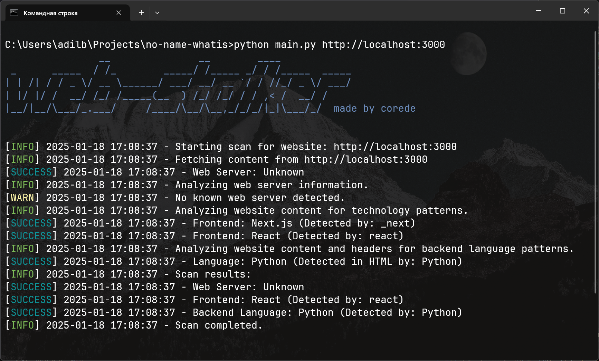

# Web Stalker

Web Stalker is a powerful tool for analyzing websites to detect frontend technologies, backend languages, and other website-related details. It is designed to provide an easy-to-use interface while allowing advanced users to customize and improve detection capabilities.



## Features

- **Frontend Technology Detection**: Identifies technologies like WordPress, React, and Django based on website content.
- **Backend Language Identification**: Detects backend languages such as Python, PHP, and Node.js through headers and HTML content.
- **Enhanced Contextual Detection** (Beta): Validates matches by analyzing surrounding content to avoid false positives.
- **JSON Output**: Allows users to export scan results in JSON format.
- **Customizable Detection Rules**: Users can expand or modify the detection rules.

## Installation

1. Clone the repository:
   ```bash
   git clone https://github.com/TheCoree/web-stalker.git
   cd web-stalker
   ```

2. Install required dependencies:
   ```bash
   pip install -r requirements.txt
   ```

## Usage

Run Web Stalker with the following command:

```bash
python web_stalker.py <website_url> [options]
```

### Options
- `--verbose`: Full informations.
- `--json`: Output scan results in JSON format.

### Example

```bash
python web_stalker.py https://example.com -o
```

## Versions

### Stable Version (Default)
The stable version includes basic detection capabilities with proven accuracy.

### Beta Version
The beta version introduces enhanced detection with contextual analysis to improve accuracy and reduce false positives.

Switch to the beta version by running:

```bash
python web_stalker_beta.py <website_url> [options]
```

## Development

To contribute or extend Web Stalker:

1. Add or update detection patterns in `self.TECHNOLOGIES` and `self.BACKEND_LANGUAGES`.
2. Enhance functions like `identify_technology_with_context` and `identify_backend_language_with_context` in the beta version.
3. Test changes using sample websites to validate improvements.

## Output Example

### Detected Frontend Technology:
```
[SUCCESS] Detected Frontend: WordPress (Context: wp-content/themes/theme-name)
```

### Detected Backend Language:
```
[SUCCESS] Detected Backend Language: Python (Header: X-Powered-By: Flask)
```

### JSON Output:
```json
{
    "Frontend": {
        "name": "WordPress",
        "detected_by": "wp-content"
    },
    "Backend Language": {
        "name": "Python",
        "detected_by": "Headers"
    }
}
```

## License

This project is licensed under the MIT License. See the [LICENSE](LICENSE) file for details.

## Contribution

Contributions are welcome! Feel free to fork the repository and submit pull requests for improvements or new features.

---

Happy stalking! 👀
